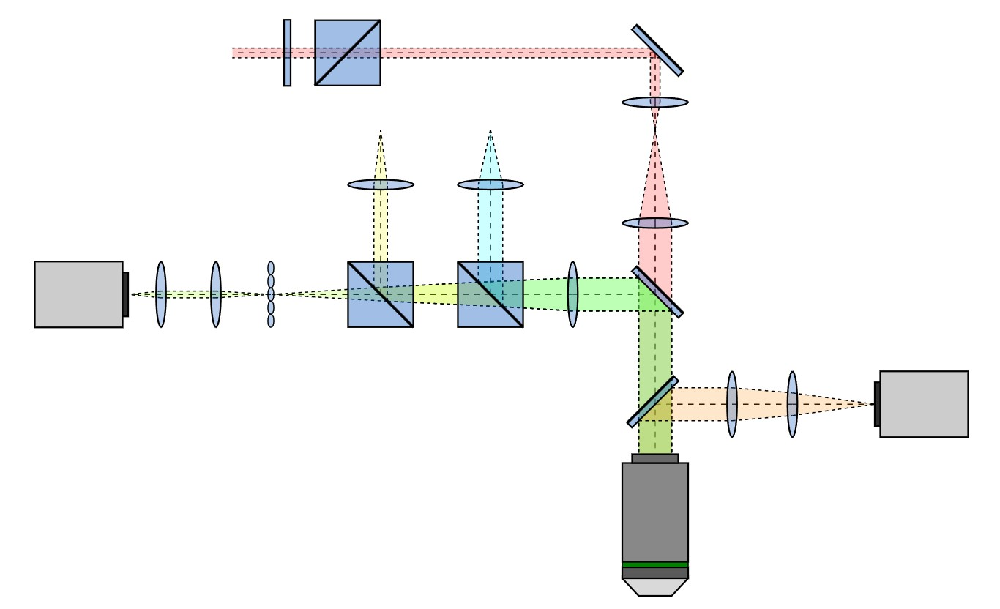
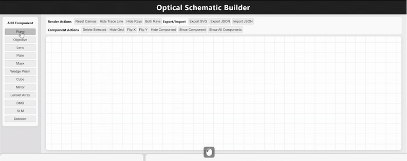
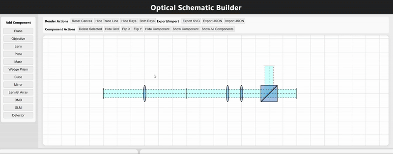

<div align="center"> Figure imitation from <a href="https://www.biorxiv.org/content/10.1101/2025.03.17.643718v2.full">Howe, Carmel L., et al., bioRxiv, 2025</a></div>

# Optical Schematics Builder

**Optical Schematics Builder** is a web app designed to simplify and accelerate the creation of optical schematics (mainly for imaging systems so far). 

[**Launch the Demo**](https://aaronzq.github.io/schematics-builder/)

## Core pipeline

Every component is spawned either as the root, or as a child of last component. It creates a chain structure that layouts the ray, which is drawn to connect every child component to its parent. The ray relies locally on the child-parent pair. An update on ray shape is performed recursively from the roots to all children, when component is moved, rotated, and/or when ray parameters have been alterd by user. Intuitively, the user could simply __follow the light__ and draw the schematics as the light propagates from the source to the detector/observer.

__No ray tracing is used. Rays are drawn only for illustration.__

## Features

- Library of components (i.e. lens, prism, mirror, etc).
- Web-based editor for component layout and automated ray drawing. 

<div align="center">
    
</div>

- Dynamic ray adjustment throughout schematics given changes in individual component.
- Configurable ray shape, color, and number (i.e. allowing for multiple rays drawn in same place).

<div align="center">
    
</div>

- Hide/Show component.
- Canvas grid. Canvas panning and zooming with mouse.
- Canvas export in SVG, directly compatible with Microsoft Powerpoint and Adobe Illustrator.
- Canvas export and import in JSON. 
- Gallery and examples.


## Features in development

- Buttons for undo and redo, as well as keyboard bindings
- Component creation and editing page for user-defined components
- Short description and illustration when mouse hovering on each buttons
- Multi-language


<!-- ## Project Structure

```
schematics-builder/
├── scripts/
│   ├── arrows.js                       # Handles drawing and updating arrows for component placement
│   ├── componentManager.js             # Manages the lifecycle and state of all components on the canvas
│   ├── components.js                   # Defines available optical components and their properties
│   ├── constants.js                    # Stores constant values used throughout the app
│   ├── eventHandler.js                 # Centralizes event listeners and dispatch logic
│   ├── gallery.js                      # Manages the example gallery and importing/exporting examples
│   ├── grid.js                         # Handles drawing and updating the background grid
│   ├── interactionHandler.js           # Manages user interactions (drag, select, zoom, etc.)
│   ├── main.js                         # Main entry point; initializes the app and ties modules together
│   ├── rayMenu.js                      # UI and logic for ray customization and overlay
│   ├── rays.js                         # Handles ray drawing, and propagation logic
│   ├── traceLines.js                   # Manages the drawing of center trace lines between components
│   ├── viewportManager.js              # Handles canvas panning, zooming, and viewport state
│   ├── modules/
│   │   ├── componentAperture.js        # Logic for component apertures and their effects on rays
│   │   ├── componentHierarchy.js       # Manages parent-child relationships between components
│   │   ├── componentPlacement.js       # Handles placement and alignment of components
│   │   ├── componentRenderer.js        # Responsible for rendering components to SVG/canvas
│   │   └── componentUtils.js           # Utility functions for component manipulation
│   └── utils/
│       ├── exportUtils.js              # Functions for exporting/importing schematics (SVG/JSON)
│       ├── mathUtils.js                # Math helper functions (geometry, transforms, etc.)
│       ├── svgUtils.js                 # Utilities for SVG manipulation and creation
│       └── validators.js               # Input and data validation helpers
├── style.css                           # Main stylesheet for the app
└── index.html                          # Main HTML file, sets up the UI layout and loads scripts
``` -->

## Contribution

### Contribute to the gallery
To contribute to the gallery, please use the following template and steps:

1. **Create your schematic** using the web app and export SVG and JSON file.
    - Place your JSON file in the `examples/` folder.
    - Place your SVG file in the `img/` folder.
2. **Add the example to the gallery** by modifying **gallery/index.html**:
    
    ```javascript
      <div class="card" data-file="template.json">
        <div class="card-image">
          
        </div>
        <div class="card-content">
          <h3 class="card-title">Template</h3>
          <button class="import-btn" onclick="importExample('template.json')">Import</button>
        </div>
      </div>
    ```

### Contribute to the component library

### Contribute to the xxx

## LLM usage

This project is largerly implemented by coding copilots using LLM. 

## Contact
[Drop me a message](mailto:zqwang9@ucla.edu) if you are interested in this project.